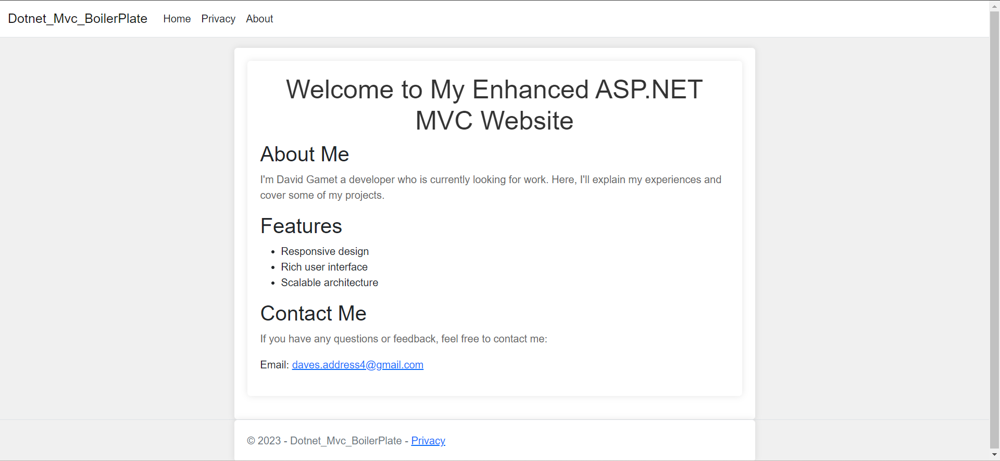

# My ASP.NET-CORE-Model-View-Controller-WebApp
# With Docker

Right now if you run this it will display the default page.https://github.com/DavesCodeData/ASP.NET-CORE-Model-View-Controller-WebApp

# How to run on Microsoft Visual Studio

Step 1: Intall Docker by going to https://www.docker.com/

Step 2: Make sure .NET is installed by typing into the terminal `dotnet --version` the version you downloaded should then appear.

If you don't know how to open the terminal and you are using Microsoft Visual Studio just press `ctrl + backtick`  Also, make sure to install ASP.NET Core Web App (Mvc) as your project template.

Step 3: Press start without debugging or `Ctrl + f5`.

Step 4: Then go into your Docker image and toggle run.
